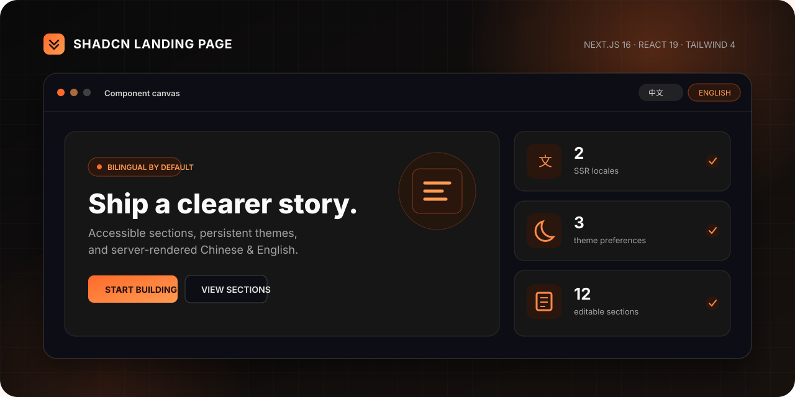
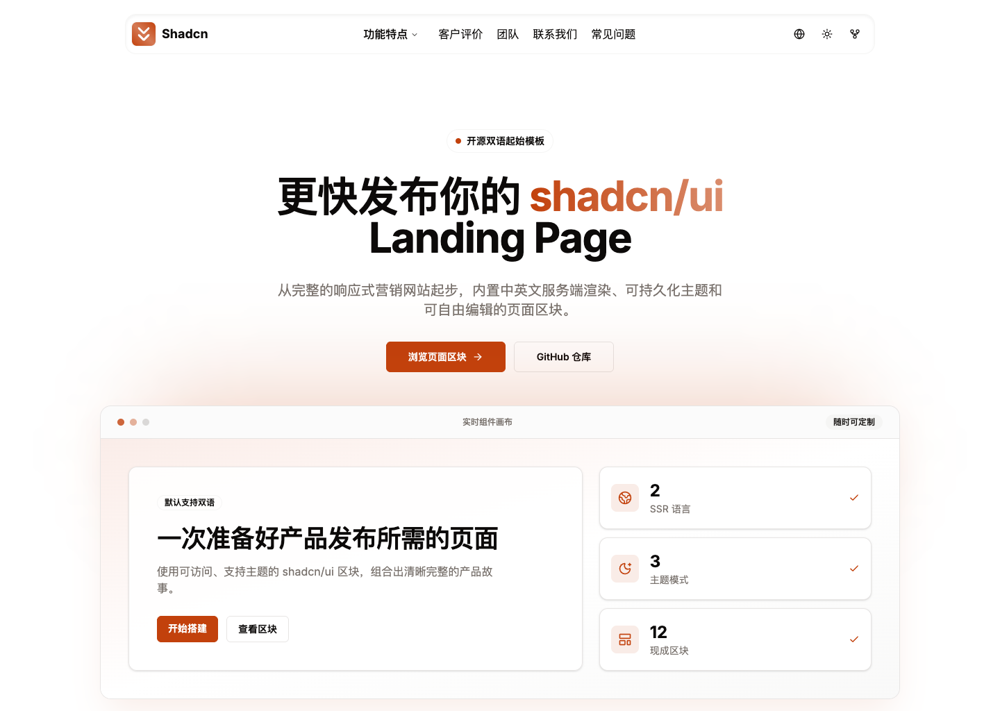
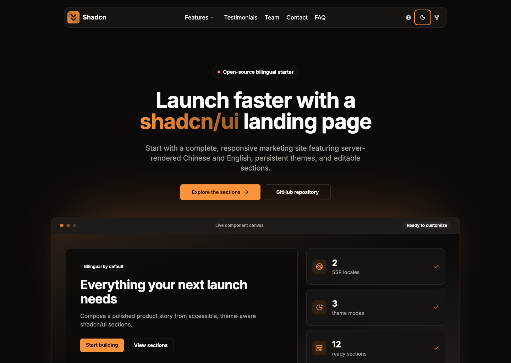
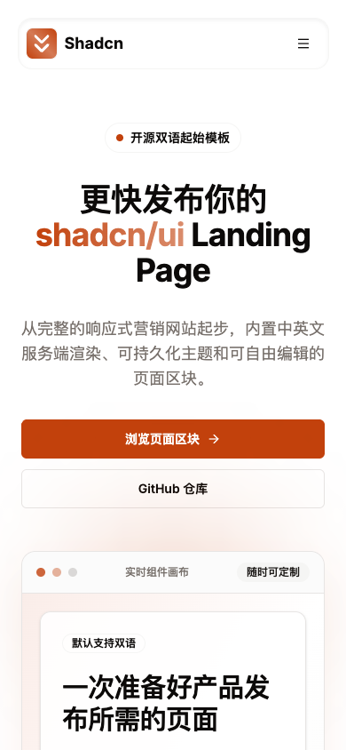
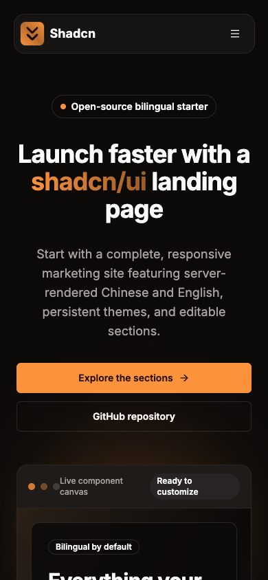

<div align="center">

# Shadcn Landing Page

**A bilingual, theme-ready Next.js starter for shipping a polished product story faster.**

[](https://github.com/LvvUP/shadcn-landing-page/actions/workflows/ci.yml)
[](https://nextjs.org/)
[](./messages)
[](./LICENSE)

[Quick start](#quick-start) · [中文文档](./README.zh-CN.md) · [Contributing](./CONTRIBUTING.md) · [Discussions](https://github.com/LvvUP/shadcn-landing-page/discussions)

</div>



Shadcn Landing Page is a customizable marketing-site starter built with Next.js 16, React 19, Tailwind CSS 4, shadcn/ui, and next-intl. It gives indie makers and product teams a coherent page structure without hiding the source behind a page builder.

> [!NOTE]
> This repository is a frontend starter, not a hosted product or backend service. People, testimonials, contact details, and pricing are explicitly fictional demo content. The site has no form backend; submitting hands the entered values to your configured mail app as a draft, where that app's privacy behavior applies.

## Live preview

<table>
  <tr>
    <td width="50%" align="center">
      
      <br><sub>中文 · Light · Desktop</sub>
    </td>
    <td width="50%" align="center">
      
      <br><sub>English · Dark · Desktop</sub>
    </td>
  </tr>
  <tr>
    <td align="center">
      
      <br><sub>中文 · Light · Mobile</sub>
    </td>
    <td align="center">
      
      <br><sub>English · Dark · Mobile</sub>
    </td>
  </tr>
</table>

All four images were captured from the real production build: `1440 × 1024` on desktop and `390 × 844` on mobile.

## Why use it

| Capability | What it gives you |
| --- | --- |
| Bilingual SSR | Chinese and English content is rendered from the server using the saved locale cookie. |
| Theme-ready UI | Light, dark, and system preferences powered by `next-themes` and editable CSS tokens. |
| Complete product story | 12 responsive sections covering value, proof, pricing, contact, and conversion. |
| Editable shadcn/ui | Local component source you can restyle, replace, or extend without framework lock-in. |
| Accessible baseline | Skip navigation, semantic sections, localized control labels, keyboard-friendly primitives, and reduced-motion handling. |
| Repeatable quality gates | Translation parity, dependency compatibility, lint, type, production build, audit, CI, and Dependabot. |

## Included sections

| Discover | Evaluate | Convert |
| --- | --- | --- |
| Hero | Benefits | Community |
| Sponsors | Features | Pricing |
| Services | Testimonials | Contact |
| Team | FAQ | Footer |

All sample identities are synthetic, and the interface no longer relies on remote avatar or stock-image hosts.

## Quick start

Requires Node.js `>= 20.9.0`.

```bash
git clone https://github.com/LvvUP/shadcn-landing-page.git
cd shadcn-landing-page
npm ci
npm run dev
```

Open [http://localhost:3000](http://localhost:3000).

Create and run a production build:

```bash
npm run build
npm run start
```

## Make it yours

| Change | Where |
| --- | --- |
| Brand colors, radius, typography, and motion | [`app/globals.css`](./app/globals.css) |
| Section content and order | [`components/layout/sections/`](./components/layout/sections) and [`app/page.tsx`](./app/page.tsx) |
| Chinese and English copy | [`messages/zh-CN.json`](./messages/zh-CN.json) and [`messages/en-US.json`](./messages/en-US.json) |
| Shared UI primitives | [`components/ui/`](./components/ui) |
| Localized title and description | The `metadata` namespace in both message catalogs |
| Locale and time-zone defaults | [`lib/i18n-config.ts`](./lib/i18n-config.ts) |

The starter uses cookie-based locale selection so the saved language is reflected in the next server response. It intentionally keeps one URL; if you need separately indexable localized pages, add locale route segments as part of your deployment architecture.

## Quality and security

Run the same complete gate used by CI:

```bash
npm run check
npm run audit
```

`npm run check` verifies both locale catalogs, blocks known incompatible dependency regressions, runs ESLint and TypeScript, and produces a full Next.js build. The audit result can change as advisories are published, so rerun it before every release.

Security fixes target the latest `main` branch. Please report vulnerabilities privately as described in [SECURITY.md](./SECURITY.md), never in a public issue. The repository also ships conservative response headers, restricted GitHub Actions permissions, automated dependency updates, and templates that remind contributors not to include secrets or private data.

## Before deploying

- Replace all demo copy, fictional identities, prices, contact details, and destination links.
- Set your production metadata, canonical URL, and analytics consent strategy; a ready-to-upload [social preview PNG](./assets/readme/social-preview.png) is included.
- Connect forms only after defining validation, abuse protection, retention, and privacy behavior.
- Test mobile widths, keyboard navigation, both locales, and every theme preference.
- Preserve [third-party notices](./THIRD_PARTY_NOTICES.md), review asset rights, and rerun `npm run check` plus `npm run audit`.

## Project structure

```text
shadcn-landing-page/
├── app/                    # App Router, metadata, layout, and global theme
├── assets/readme/          # Repository-native README artwork
├── components/
│   ├── layout/             # Navigation, locale/theme controls, page sections
│   └── ui/                 # Editable shadcn/ui primitives
├── lib/                    # Locale configuration and shared utilities
├── messages/               # zh-CN and en-US catalogs
├── scripts/                # Deterministic project checks
├── .github/                # CI, Dependabot, and contribution templates
├── CONTRIBUTING.md
├── SECURITY.md
├── THIRD_PARTY_NOTICES.md
└── NOTICE.md
```

## Contributing and attribution

Focused bug fixes, accessibility work, documentation improvements, and reusable section enhancements are welcome. Read [CONTRIBUTING.md](./CONTRIBUTING.md) before opening a pull request.

This project continues work from [nobruf/shadcn-landing-page](https://github.com/nobruf/shadcn-landing-page), itself based on [leoMirandaa/shadcn-vue-landing-page](https://github.com/leoMirandaa/shadcn-vue-landing-page). Upstream copyright notices and the modernization history are preserved in [NOTICE.md](./NOTICE.md).

Released under the [MIT License](./LICENSE).

<div align="center">

If this starter saves you time, a **Star** helps other builders discover it.

</div>
